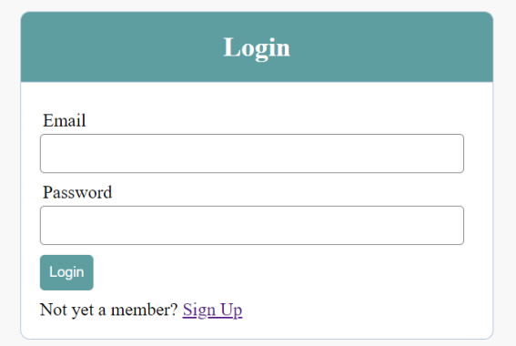
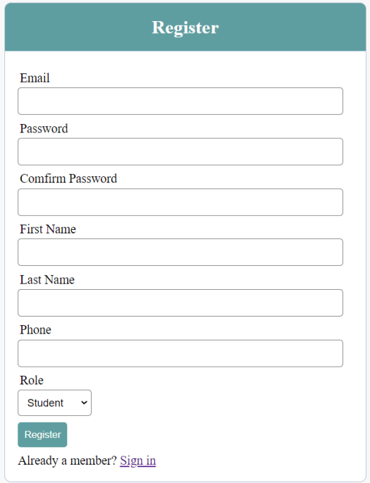
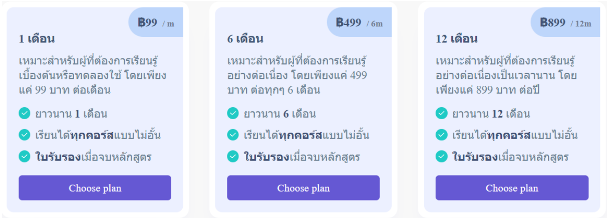
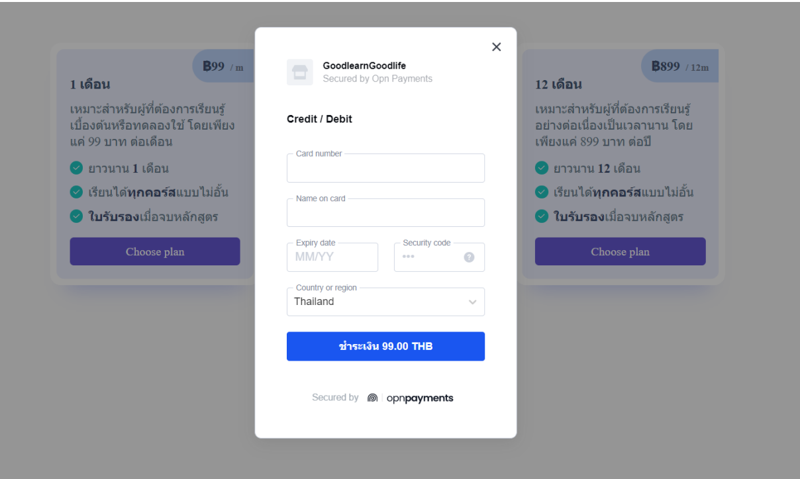
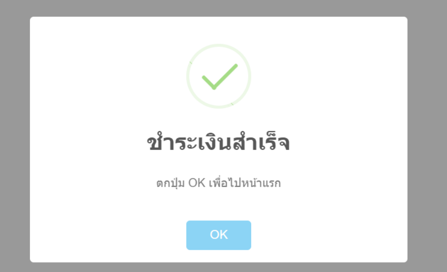
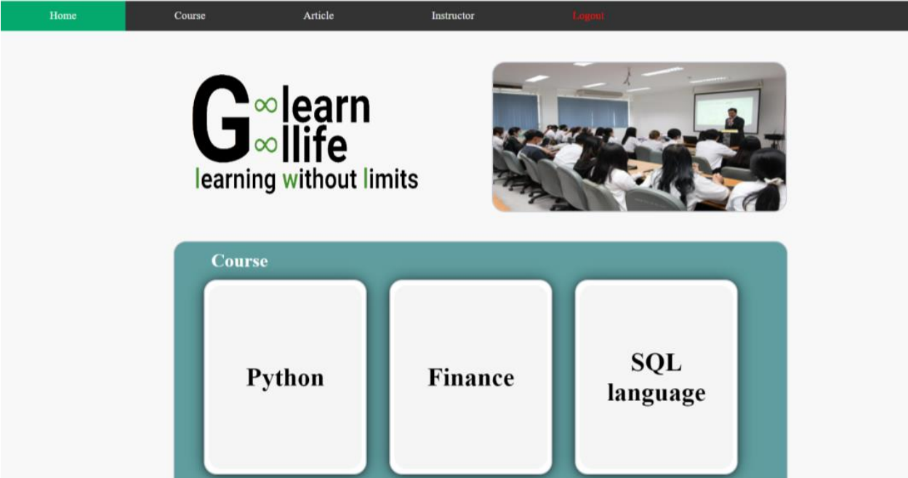
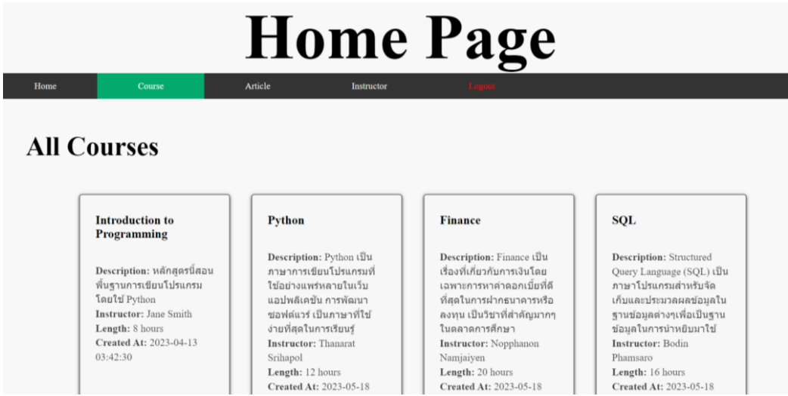
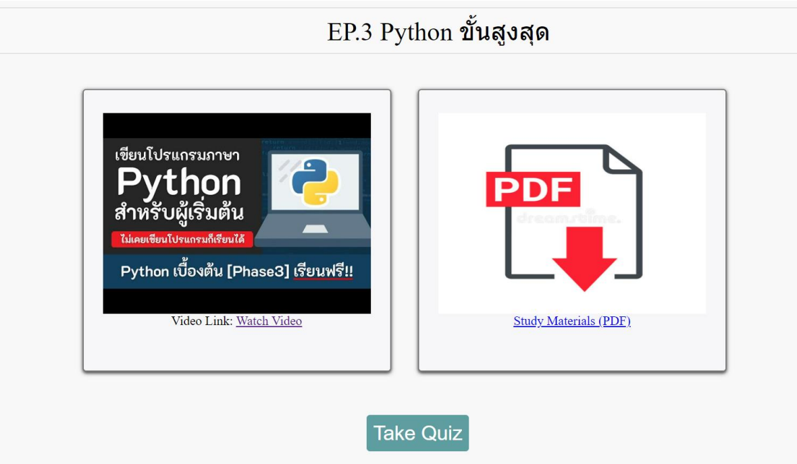

# E-Learning
This project is in the <b>database system concepts</b> course..   
<b>Note that since it's just a project in one subject at university, it's difficult to implement every function.</b>

# Installation
  1. Set up a web server depending on what you use or <a href="https://www.simplilearn.com/tutorials/php-tutorial/php-using-xampp">XAMPP Tutorial</a>. 
  2. Import the <a href="https://github.com/Thanarat-DS/E-Learning/blob/main/MySQL/e.sql">e.sql</a> file into the database.
  3. Edit the <b>server.php</b> to match your database.
  4. Edit the <b>[table]_payment.php</b> to activate the payment system by enter the public key and secret key instead of underscores at lines 20-21.

Your own public key and secret key can be found on your dashboard at <a href="https://www.omise.co/">omise</a>

# E-Learning Website (Project from KMITL University)

## 🧰 Tech Stack

- **Frontend:** HTML, CSS  
- **Backend:** PHP  
- **Database:** MySQL  
- **Features:** API Payment Gateway  

## Login  
</img>

## Register  
Separates roles between instructor and student.  
</img>

## Payment Plan  
</img>

## Payment Enter Credit Card  
</img>

## Success Payment  
</img>

## Home Page  
</img>

## Home Page (continued)  
</img>

## Courses List  
</img>

## In Course  
</img>
